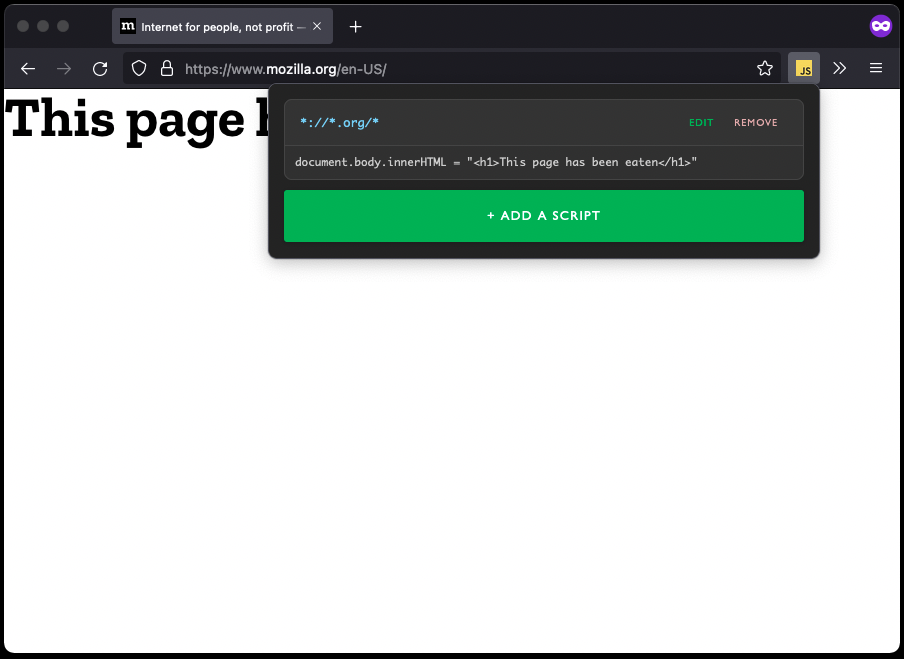

# Javascript Injector

This webextension allows to create create JS scripts that are evaluated at a given domains without being blocked by CSP.
It also provides a simple shortcut service that can be used to create custom shortcut handlers with JS.



## Browsers

Extension was tested on Mozilla Firefox 90 and Chromium (92) based browser (Brave).

- [Mozilla Firefox add-on](https://addons.mozilla.org/pl/firefox/addon/shark-javascript-injector/)

## Setup

Technologies:

- TypeScript
- Vue 3 with TSX and styled components for UI
- Parcel 2 as build tool

### Development

```sh
# install dependencies
npm i

# start watching source and run rebuild on changes
npm run dev
```
### Build extension for publish

```sh
# install dependencies
npm i

# build source and zip extension
npm run build
```

### Example scripts

- [Github notifications arrow navigation](https://gist.github.com/rossinek/0d1082327366cb83a69d4fb4fcec7498)
- [Harvest (time tracking) arrow navigation](https://gist.github.com/rossinek/99b84d984771ae510f237747efd3e265)


